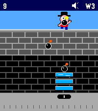

# Kablooey!

A game inspired by the Atari 2600 classic, Kaboom!, for the Pebble Time 2.
A cartoon mad bomber (Scarry Kablam) paces across the top of the screen
lobbing lit bombs; you slide a stack of water pails along the bottom to
douse them. Miss one and the blast costs you a pail, and the catch line
drops with it. Lose all three and it's kablooey.



## Controls

- **Slide** anywhere on the bottom half of the screen to steer the pails. They
  go where your finger is, so you can jump across the screen as fast as you can
  move your thumb.
- **Tap** to start a wave, and to carry on after one ends. The wave begins the
  moment your finger lands.
- **Top button** toggles sound.
- **Select** opens the menu: difficulty, pail width, sound, vibration, reset
  high score, and how to play.

## How to play

Every bomb you douse scores the number of the wave you are on: 1 point each on
wave 1, 7 each on wave 7. Clear a wave and you move up to the next one.

Scarry paces the top of the wall and doubles back at random, so you cannot
read where he will be. Every wave throws more bombs than the last, and the
waves take turns raising the stakes: on one he throws quicker and the bombs
fall faster, on the next he walks faster and turns back sooner. So a wave is
either the same bomber speeding up or the same rain of bombs coming from a
bomber you can no longer follow.

Two settings make the game harder, and they are independent. **Difficulty**
picks the wave a run starts on — 1, 3 or 6 — which is also the lowest a miss
can knock you back to. **Pail width** narrows the pails from 38 pixels to 26,
a third less of the screen to catch with, at any starting wave. Changing
either one starts a fresh game.

A bomb that reaches the ground blows up a pail, and every other bomb in the air
goes off with it, one at a time from the bottom up. It also knocks you back a
wave: you replay the one before it, then face the wave that beat you again.
Lose all three pails and the game is over.

Your high score is kept between games, and the final banner says so when you
have just set one.

## Difficulty

Easy, Normal and Hard start you at wave 1, 3 and 6. Since later waves pay more
per catch, starting higher scores faster — and your starting wave is also the
lowest a miss can knock you back to. Changing difficulty starts a new game.

## Sound

Catches splash, misses thud, and the chain reaction pops its way up the screen.
The top button or the menu turns sound off, and vibration has its own switch
next to it. Both settings are remembered.

If the watch itself has the speaker muted — system-wide or during Quiet Time —
the menu shows sound as "Muted by watch" and leaves it alone until you unmute.

## Building

Built with the Pebble SDK for the Time 2 (`emery`):

```sh
pebble build
pebble install --emulator emery     # or --cloudpebble for a real watch
```

`DIARY.md` covers how it was built and why it works the way it does, including
the demo build and the screen-capture tooling.

## License

MIT, see [LICENSE](LICENSE).
